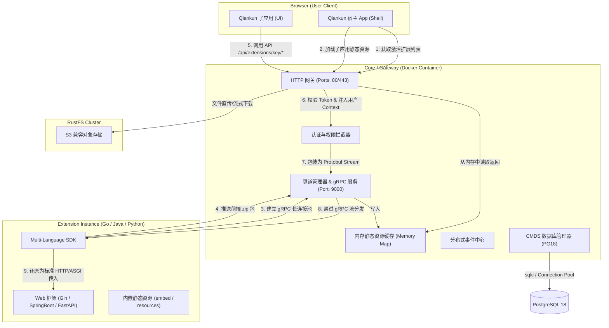

> **历史文档 — 已被取代。**
>
> 本文描述的是最初的反向 gRPC 隧道架构：扩展作为独立进程主动拨号连接 Core，
> 并有 Go / Python / Java 三套 SDK。该架构已被 HashiCorp go-plugin 子进程模型
> 取代 —— Core 现在自己启动插件，因而具备热加载、热更新与请求生命周期 Filter。
>
> 当前设计见 [README](../../../README.zh-CN.md) 与
> [插件开发指南](../../plugin-development.md)。此文保留仅作演进记录。

# Moduless 跨语言模块化开发框架设计方案 (Multi-Language Modular Framework Spec)

## 1. 概述与设计理念

本框架旨在为团队提供一套**低上手门槛、高代码隔离、部署容器化、调试简易**的模块化开发体系。

### 1.1 核心技术栈
* **核心网关 (Core/Gateway)**: Go 语言
* **数据库 (Database)**: PostgreSQL 18
* **SQL 编译器**: sqlc (自动生成类型安全的 Go 数据库操作代码)
* **数据库迁移**: go-migrate (管理数据库结构的版本演进)
* **对象存储 (Object Storage)**: RustFS (高并发、内存安全的分布式 S3 兼容存储)
* **微前端引擎 (Micro-Frontend)**: Qiankun (基于 Single-SPA 的前端微应用托管)
* **通信协议**: gRPC & Protobuf (跨语言的高性能长连接双向通道)

### 1.2 核心设计准则
1. **暗黑服务与零暴露端口 (Zero-Port Exposure)**: 除去网关 (Core/Gateway) 外，扩展模块在生产与开发环境中均**不打开任何监听端口**。扩展通过主动连接 Core 的 gRPC 服务注册并维持长连接通道。
2. **微前端资源内存化 (In-Memory FE Cache)**: 扩展的前端静态资源在注册时以 `zip` 格式流式推送到 Core，Core 仅在内存（Memory Map）中进行解压缓存并提供服务，不落盘。
3. **Core 托管文件服务 (Streaming & Presigned)**: 文件上传与下载完全由 Core 托管。上传直达 Core 并生成 `file_id`，下载采用无问号、纯路径参数的安全临时 Token 路由：`/api/system/files/download/<file_id>/<temp_token>`。扩展仅管理 `file_id` 字符串。
4. **Core 托管数据库服务 (CMDS)**: 扩展不建立物理数据库连接。由 Core 建立数据表并提供 Document Store API。

---

## 2. 系统整体架构

整个系统以 **Core/Gateway** 为中心枢纽，连接外部浏览器和内部的暗黑扩展服务：



---

## 3. Core 基线功能清单

Core 包含以下首批建设的基线功能模块：

1. **统一身份认证与权限引擎 (Auth & RBAC)**: 解析 JWT 并校验用户权限。向 API 转发中注入 `X-User-Id`、`X-User-Roles`、`X-User-Permissions`。
2. **统一文件服务 (File Service)**: 对接 RustFS。提供直传和授权下载流服务。向内部 SDK 提供 `GenerateDownloadToken` 等 gRPC API。
3. **隧道与路由管理器 (Tunnel & Route Manager)**: 维护活跃的 gRPC 双向连接。当扩展断开时，提供 10 秒的优雅卸载缓冲期。
4. **内存缓存宿主 (FE Host Cache)**: 动态注册 Qiankun 微前端子应用，并通过内存 Map 直接响应静态资源。
5. **分布式事件总线 (Event Bus over gRPC)**: 允许扩展通过 gRPC 订阅/发布系统事件。本地开发时由 Core 逆向投递，免除本地部署中间件（Redis/RabbitMQ）的成本。
6. **动态前端插槽系统 (UI Slot Engine)**: 允许扩展在 `manifest.yaml` 中声明插槽挂载。宿主页面动态拉取并以组件级微前端嵌入运行，实现页面内部的深度解耦集成。
7. **统一操作审计日志 (Audit Logging)**: 通过读取 `manifest.yaml` 中的敏感 API 声明，自动拦截提取入参，渲染审计日志并持久化，开发无需在扩展中写审计代码。
8. **动态配置中心 (Dynamic Config)**: 在 PG18 中维护配置版本，当配置变更时，通过 gRPC 隧道实时推送配置包，SDK 自动热重载。
9. **开发诊断面板 (Diagnostics Dashboard)**: 提供可视化的网关管理页面，实时监控各扩展的连接健康度、隧道延时（RTT）、已用缓存内存等指标。

---

## 4. 统一数据库服务设计 (CMDS)

**Core-Managed Document Store (CMDS)** 彻底免去了扩展自行连接数据库的心智开销。

### 4.1 底层表结构设计 (PostgreSQL 18)
Core 在收到扩展注册后，将为每个集合（Collection）自动建立一张独立的物理隔离数据表，表名为 `ext_<extension_key>_<collection_name>`：

```sql
CREATE TABLE IF NOT EXISTS ext_usermanager_items (
    id VARCHAR(100) PRIMARY KEY,
    data JSONB NOT NULL,
    created_at TIMESTAMPTZ DEFAULT CURRENT_TIMESTAMP,
    updated_at TIMESTAMPTZ DEFAULT CURRENT_TIMESTAMP
);
```

### 4.2 声明式索引对齐 (Auto Index Reconcile)
扩展的 `manifest.yaml` 可以声明该表需要的索引：
```yaml
database:
  collections:
    - name: "items"
      indexes:
        - fields: ["status"]
        - fields: ["code"]
          unique: true
```
当扩展注册时，Core 在后台对比实际 PG 中的索引状态，自动增删索引：
* 若存在声明但 PG 中没有：自动生成 `CREATE INDEX idx_... ON ... ((data->>'status'))`。
* 若 PG 中有但声明中已移除：自动生成 `DROP INDEX ...` 销毁。

### 4.3 声明式数据迁移 (Declarative Migrations)
对于字段破坏性变更（如字段重命名），扩展可在 `manifest.yaml` 中进行声明：
```yaml
version: "1.1.0"
database:
  collections:
    - name: "items"
  migrations:
    - version: "1.1.0"
      actions:
        - type: "rename_field"
          collection: "items"
          from: "name"
          to: "full_name"
```
Core 判定扩展版本升级时，会执行对应的 PG JSONB 修改 SQL：
```sql
UPDATE ext_usermanager_items 
SET data = (data - 'name') || jsonb_build_object('full_name', data->'name') 
WHERE data ? 'name';
```
在完成所有迁移动作后，再更新扩展版本，并允许其对外服务，确保迁移安全性与无感升级。

---

## 5. gRPC 协议定义 (包含数据与事件)

```protobuf
syntax = "proto3";

package moduleless;

option go_package = "./tunnel";

service ExtensionTunnel {
  // 建立双向通信通道
  rpc Connect(stream TunnelMessage) returns (stream TunnelMessage);
}

// 核心数据库代理服务
service DatabaseService {
  rpc Put(PutRequest) returns (PutResponse);
  rpc Get(GetRequest) returns (GetResponse);
  rpc Delete(DeleteRequest) returns (DeleteResponse);
  rpc Find(FindRequest) returns (FindResponse);
}

// 分布式事件总线服务
service EventBusService {
  rpc Publish(PublishRequest) returns (PublishResponse);
  rpc Subscribe(stream SubscribeRequest) returns (stream EventMessage);
}

message TunnelMessage {
  string message_id = 1;
  oneof payload {
    RegisterRequest register_req = 2;
    FileChunk file_chunk = 3;
    RegisterComplete register_complete = 4;
    RegisterResponse register_resp = 5;
    HttpRequestChunk http_req_chunk = 6;
    HttpResponseChunk http_resp_chunk = 7;
    Ping ping = 8;
    Pong pong = 9;
  }
}

// ================== DB 传输结构 ==================
message PutRequest {
  string collection = 1;
  string document_id = 2;
  bytes json_data = 3;
}
message PutResponse { bool success = 1; }

message GetRequest {
  string collection = 1;
  string document_id = 2;
}
message GetResponse {
  bool found = 1;
  bytes json_data = 2;
}

message DeleteRequest {
  string collection = 1;
  string document_id = 2;
}
message DeleteResponse { bool success = 1; }

message FindRequest {
  string collection = 1;
  repeated QueryFilter filters = 2;
  int32 limit = 3;
  int32 offset = 4;
}
message QueryFilter {
  string field = 1;
  string operator = 2; // "=", ">", "<", "LIKE"
  string value = 3;
}
message FindResponse {
  repeated bytes documents = 1;
}

// ================== 事件总线传输结构 ==================
message PublishRequest {
  string event_name = 1;
  bytes event_data = 2;
}
message PublishResponse { bool success = 1; }

message SubscribeRequest {
  string event_name = 1;
}
message EventMessage {
  string event_name = 1;
  bytes event_data = 2;
}

// ================== 注册及 HTTP 通道结构 ==================
message RegisterRequest {
  string extension_key = 1;
  string version = 2;
  string display_name = 3;
  string menu_icon = 4;
  string menu_path = 5;
  uint64 zip_file_size = 6;
  string zip_sha256 = 7;
  bool is_dev = 8;
  string dev_frontend_url = 9;
}
message FileChunk {
  bytes content = 1;
  uint32 chunk_index = 2;
}
message RegisterComplete {}
message RegisterResponse {
  bool success = 1;
  string error_message = 2;
  bool skip_upload = 3;
}
message HttpRequestChunk {
  string stream_id = 1;
  bool is_first = 2;
  bool is_last = 3;
  string method = 4;
  string path = 5;
  string query = 6;
  map<string, string> headers = 7;
  bytes body_chunk = 8;
}
message HttpResponseChunk {
  string stream_id = 1;
  bool is_first = 2;
  bool is_last = 3;
  int32 status_code = 4;
  map<string, string> headers = 5;
  bytes body_chunk = 6;
}
message Ping { int64 timestamp = 1; }
message Pong { int64 timestamp = 1; }
```

---

## 6. 多语言 SDK 桥接机制

三种语言的 SDK 核心职责是将 gRPC 的流式数据包桥接到各语言最流行、最成熟的 Web 框架中，使开发者可以使用原生体验开发业务：

### 6.1 Go SDK 设计 (支持 Gin)
* **原理**: 将 gRPC `HttpRequestChunk` 的首包转化为标准库 `*http.Request`，其 Body 指向一个 `io.PipeReader`。SDK 拦截器把后续到来的 Chunk 写入关联的 `io.PipeWriter`，并调用 `gin.Engine.ServeHTTP` 处理。输出数据通过一个自定义 Mock 的 `ResponseWriter` 截获并转化为 `HttpResponseChunk` 推出。
* **CMDS 使用示例**:
  ```go
  r.GET("/item/:id", func(c *gin.Context) {
      var item Item
      err := sdk.DB.Get(c.Request.Context(), "items", c.Param("id"), &item)
      c.JSON(200, item)
  })
  ```

### 6.2 Python SDK 设计 (支持 FastAPI / ASGI)
* **原理**: FastAPI 完全兼容 ASGI 规范。SDK 内部在收到请求首包后，构建 ASGI `scope`（包含 HTTP 协议基础元数据），并派发异步任务调用 FastAPI 实例。SDK 创建两个 `asyncio.Queue` 分别扮演 ASGI 中读取 Body 的 `receive` 方法和写入 Response 的 `send` 方法。
* **CMDS 使用示例**:
  ```python
  @app.get("/item/{id}")
  async def get_item(id: str):
      item = await sdk.db.get("items", id)
      return item
  ```

### 6.3 Java SDK 设计 (支持 Spring Boot)
* **原理**: Spring MVC 核心由 `DispatcherServlet` 执行流量解析与转发。Java SDK 底层接管 gRPC 管道，使用 `io.piped` 将其流式数据封装进一个继承了 `HttpServletRequestWrapper` 的自定义请求对象中，反射调用 `dispatcherServlet.service(req, resp)`，最终通过 Mock 的 HttpServletResponse 抓取输出包分片返回。
* **CMDS 使用示例**:
  ```java
  @GetMapping("/item/{id}")
  public ResponseEntity<Item> getItem(@PathVariable String id) {
      Item item = sdkDb.get("items", id, Item.class);
      return ResponseEntity.ok(item);
  }
  ```

---

## 7. 示例项目目录规范

官方提供的快速上手示例仓库位于 `extension-example` 目录下：

```
extension-example/
├── go/
│   ├── frontend/             # Qiankun 微前端子应用 (Vue/Vite)
│   └── backend/              # Go 后端应用 (Go SDK + Gin)
├── python/
│   ├── frontend/             # Qiankun 微前端子应用 (React/Vite)
│   └── backend/              # Python 后端应用 (Python SDK + FastAPI)
└── java/
    ├── frontend/             # Qiankun 微前端子应用 (Vue/Vite)
    └── backend/              # Java 后端应用 (Java SDK + Spring Boot)
```
